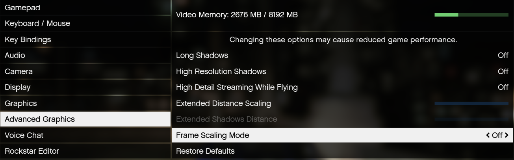
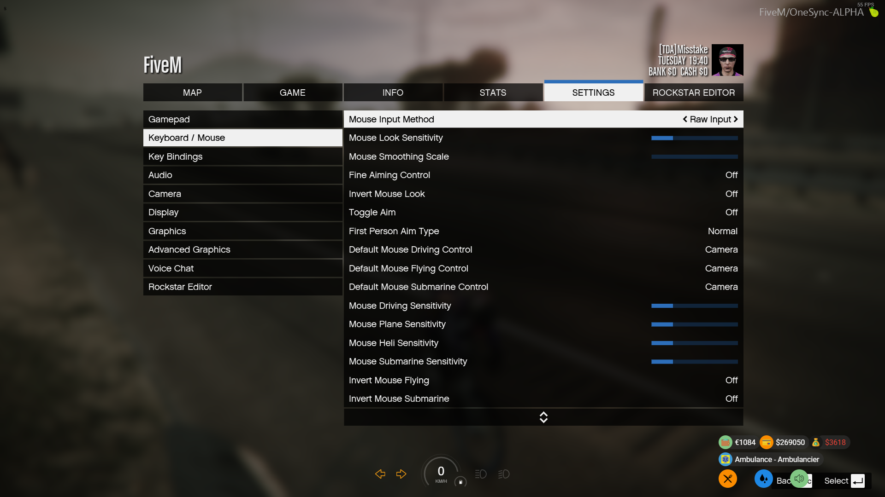

# Bekende problemen en fixxes
Hier vind je bekende problemen en mogelijke oplossingen voor in de server.

## Citybug

Voor de "city bug" (door map heen vallen op hoge snelheden) probeer deze instellingen en let ook vooral op frame scaling en Texture Quality, deze zijn het allergelangrijkst om city bug te voorkomen.

Zorg er verder voor dat je C schijf niet tjok vol is, dus zorg ervoor dat je Windows dingen kwijt kan op de C schijf. Anders kun je ook nog proberen je page file groter te maken, maar dit kan in principe door simpel weg je C schijf meer ruimte te geven (10 GB vrije ruimte zou meer dan genoeg moeten zijn)

## Upgrades LS Costums die niet werken

Als je upgrades niet ziet in LS Customs, ga eerst even terug, wacht een paar seconden e probeer het opnieuw, werken ze dan nog steeds niet geef dan even het model van de auto door.

## Problemen met UI

Voor mensen die problemen hebben met UI's (muis die kan bewegen en character die ook mee beweegt) zorg er dan voor dat je Mouse Input Method staat op Raw Input zoals op de screenshot hierboven

## Problemen met bellen

Voor de mensen die problemen hebben met hun telefoon (je hoort mensen wel maar zij horen jou niet) zorg er dan voor dat de microfoon die je normaal gebruikt ook in je windows instellingen als standaard staat ingesteld! Anders pakt hij de verkeerde microfoon

## Game die blijft hangen

Mocht fivem niet openen en blijf je hangen in het zogenaamde blauwe loading screen dan kan dit helpen.
Doe rechterklik op je bureaublad scherm en ga naar nvidia configuratie scherm. Vervolgens ga je naar 3d instellingen beheren
En zet je voorkeur grafische processor op krachtige nvidea processor

## Vel dashboard

mocht je last hebben van een vel dashboard zet dan je postfx lager

